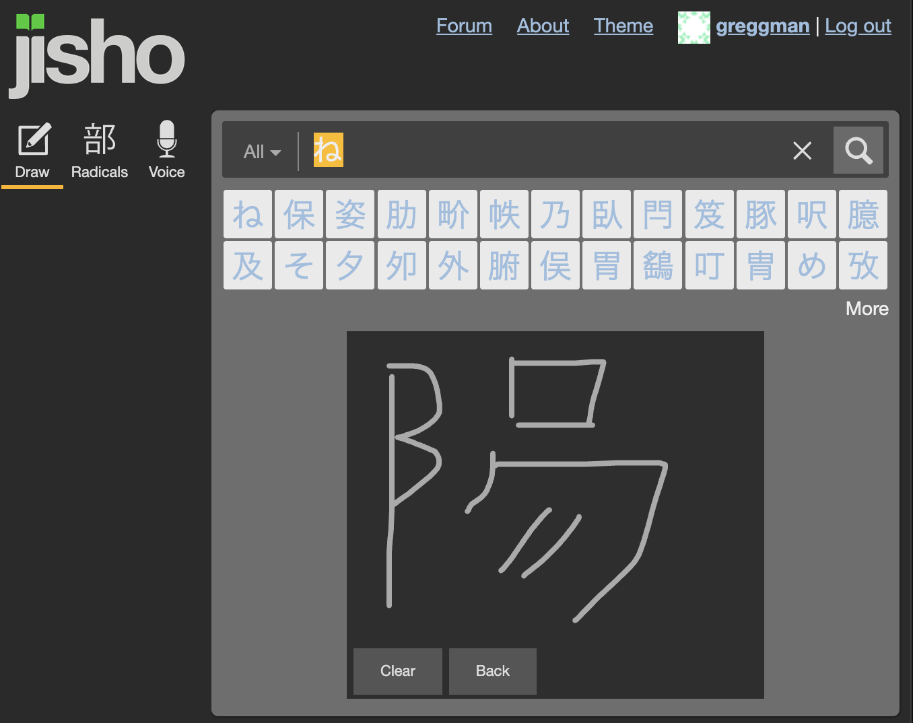
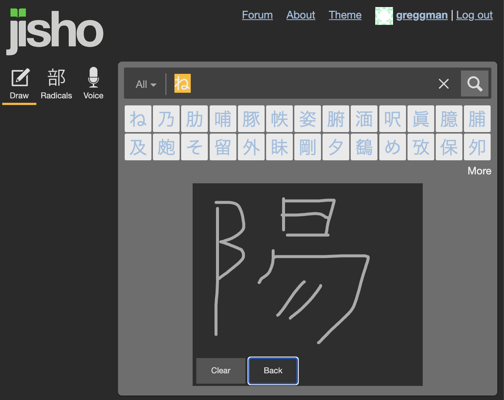
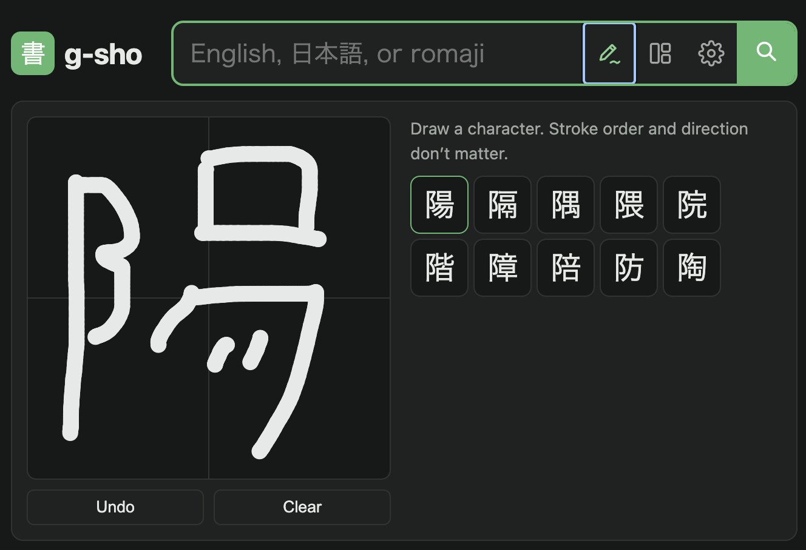
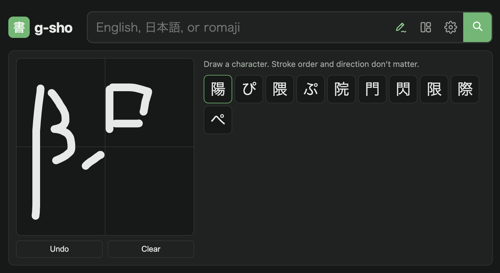

# g-sho

A Japanese–English dictionary website inspired by [jisho.org](https://jisho.org).
Search in English, Japanese, or romaji, paste a sentence to see its words, or
find kanji by radical.

## Features

* Sync across devices ([*](#sync))
* Builtin FSRS Flashcards
* Anki import/export
* Japanese->Japanese dictionary
* Easier Handwriting Recognition

## Why?

The number one reason probably boils
down to jisho.org is not open source. if it was I would have made a pull request.

For me the issue is frictions. I needed to quickly look up a kanji in a book. There are lots of ways to do this including taking a picture of the book and have my phone let me select the character. But, sometimes that seems a longer path than sketching a single kanji into an app. So I sketched it into jisho.org. Unfortunately, just guessing, like many Japanese input systems, it’s stroke count, order, and direction sensitive. Get one wrong and it won’t find the character. Which, is arguably bad for a person trying to learn since it requires them to already know what they are trying to look up.

You can see here me trying to look up a character and jisho.org shows nothing close



Note that my eyes are bad so when I was trying to look up there character from a book,
I could not see there was a supposed to be line in that upper right part.

But, even adding that line, jisho.org does not find the character



I'm guessing, it's because it's using stroke order.

g-sho uses image based neural network style lookup, so even if you don’t know the count, order, or direction it will hopefully find the character you were looking for.

Trying the example above it finds it easily



In fact, maybe this is just luck, but it gets there pretty quick



It would be great if jisho.org could add this.

Another issue I ran into. I use a couple of dictionaries on my phone. I can paste a whole sentence into them and they’ll look up all the words in a scrolling list, one line per word. This makes it much MUCH faster to work though a sentence. jisho puts up the sentence but only looks up the first word, the you have to click each word to look that one up. This small friction adds to the learning effort. g-sho gives you the list.

g-sho also integrates with Anki Connect. I’m not entirely sure if that’s useful given Yomitan does that to but it was easy too add

Maybe the biggest take away is how easy it is in September 2026. The data is all public and open source so I asked Claude to use jisho as inspiration. I asked it to make it work as a static site and shard the dictionary. Less than a hour later it was ready to use. Another hour added the handwriting, strokes, Anki and definition order. A few minutes more added options and history.

~It's a~, *It was* a fully static site. At build time the dictionary is split into small
JSON shards; the browser fetches only the shards a search needs, so it can be
hosted on GitHub Pages or any static file server. See [PLAN.md](PLAN.md) for the
design. This also means less server cost. There is no database being queried.
The shards are cached by your browser so as you look up words, more and more of
the dictionary is local, making it faster.

## Sync

g-sho can sync across devices. Currently it needs a github account. Will try to add
more services later. Note: It only uses github for a user id. It does not keep your email address
or any other account data. It does keep your word history and flashcards because otherwise
what would be the point? Note that I'm paying for syncing. I added syncing because I needed
it. If it gets abused I real remove it and set it up just for myself SO PLEASE DON'T ABUSE IT!

## Development

Requires Node 24 or newer, and Rust with the WebAssembly target for the
handwriting recognizer's kernels (`rustup target add wasm32-unknown-unknown`).

```sh
npm install
npm run download     # fetch the dictionary data and handwriting model into .cache/
npm run build:data   # build the data shards into dist/data/
npm run dev          # build the app, watch for changes, serve at http://localhost:8787
```

Signing in locally: the local database lives in `.wrangler/`. "Sign in with
GitHub" needs the app's secret in a gitignored `.dev.vars` file
(`GITHUB_CLIENT_SECRET=…`). Without GitHub, open
http://localhost:8787/api/auth/dev/start?name=amy to sign in as a made-up
user. That works only in local dev.

Other scripts:

| Script | What it does |
| --- | --- |
| `npm run build` | Production build of the app into `dist/` |
| `npm run serve` | Build once and serve `dist/` |
| `npm run dev:server` | Just the static site: build, watch, serve at http://localhost:8000 (no `/api`) |
| `npm run dev:worker` | Just the Worker at http://localhost:8787 (`/api`, proxies the rest to :8000) |
| `npm test` | Unit tests, plus end-to-end search tests if `dist/data` is built |
| `npm run lint` / `npm run fix` | gts lint / auto-fix |
| `npm run check` | Typecheck, lint, and test |

## Handwriting recognition

Drawn characters are recognized by a neural network that runs in the browser
on our own inference code (no ML runtime library):

- `scripts/onnx.ts` / `scripts/convert-onnx.ts` convert the ONNX model to our
  format (`model.json` + fp16 `weights.bin`) at build time.
- `src/client/nn/` runs it: WebGPU compute shaders (`webgpu.ts`), with a
  WebAssembly SIMD fallback (`wasm.ts` + `src/wasm/nn.rs`) and a plain
  JavaScript reference (`cpu.ts`), all in a worker.
- `ml/` holds the Python tools used to check our implementation against ONNX
  Runtime (`lt8_reference.py` writes `test/fixtures/lt8-vectors.json`).
  Set it up with `uv venv ml/.venv && uv pip install --python ml/.venv/bin/python onnx onnxruntime numpy pillow svgpathtools`.

Add `?engine=wasm` or `?engine=js` to the URL to force an engine.

## Anki

Open **Settings** (the gear) and connect in the Anki section: with the Anki app running and the
[AnkiConnect](https://ankiweb.net/shared/info/2055492159) add-on installed,
Anki asks whether to allow the site. Then every entry has a [+] to add it.
See PLAN.md for details.

## Study, sync, and Anki decks

- **Study** (the cards button in the header): add words with "+ study" on any
  entry, then review them with FSRS, the scheduler modern Anki uses.
- **Import** Anki decks: drop an `.apkg` (or `.colpkg`, or Anki's plain-text
  export) anywhere on the site, paste a copied file, or use Study → Import.
  Notes are linked to their dictionary entries, and cards keep their
  templates (shown in a sandboxed frame), schedule and review history.
- **Export** a deck: Study → a deck's options → Download .apkg, or Send to
  Anki (AnkiConnect).
- **Japanese definitions** (Settings → Japanese definitions): definitions in
  Japanese from the Japanese Wiktionary, every word linked and with furigana;
  turn off English meanings to use g-sho as a Japanese–Japanese dictionary.
- **Sync**: sign in with GitHub (Settings → Account) to sync history, marks,
  notes, settings and decks across devices. Imported images and sounds stay
  on the device for now.

The design is in [DESIGN-SERVER.md](DESIGN-SERVER.md), the plan in
[PLAN-SERVER.md](PLAN-SERVER.md). The import tests use packages made by real
Anki (`test/fixtures/anki/`); to remake them:

```sh
python3 -m venv .venv-anki && .venv-anki/bin/pip install anki
.venv-anki/bin/python scripts/make-anki-fixtures.py
```

## Deploying

`.github/workflows/deploy.yml` builds the app, then deploys `dist/` and the
Worker (`src/server/`, the `/api` endpoints) to Cloudflare with `wrangler
deploy`. It runs on every push to `main`. Pull requests only build and test.

The dictionary data changes at most quarterly. Builds use the newest
`data-…` GitHub release (the built `dist/data`, ~84 MB compressed) instead of
downloading the sources, so pushes never change the data. On 1 January,
April, July and October, or when you run the workflow by hand with **Refresh
the dictionary data** ticked, it downloads the latest sources, builds the
data, and publishes a new `data-…` release once the tests pass. (The first
run, with no data release yet, does the same.) The deploy job uses the
GitHub environment `production`, whose secret `CLOUDFLARE_API_TOKEN` is
limited to the `main` branch. See [PLAN-SERVER.md](PLAN-SERVER.md) for the
Cloudflare setup.

## Data and licenses

Dictionary data comes from [JMdict](https://www.edrdg.org/wiki/index.php/JMdict-EDICT_Dictionary_Project),
[KANJIDIC2](https://www.edrdg.org/wiki/index.php/KANJIDIC_Project), and
[RADKFILE/KRADFILE](https://www.edrdg.org/krad/kradinf.html) by the
[Electronic Dictionary Research and Development Group](https://www.edrdg.org/)
(CC BY-SA 4.0), stroke order from [KanjiVG](https://kanjivg.tagaini.net/)
(CC BY-SA 3.0), word frequencies from [wordfreq](https://github.com/rspeer/wordfreq)
(CC BY-SA 4.0), with example sentences from [Tatoeba](https://tatoeba.org/)
(CC BY 2.0 FR), via [jmdict-simplified](https://github.com/scriptin/jmdict-simplified).
The handwriting model is [LT8/japanese-handwriting-onnx](https://huggingface.co/LT8/japanese-handwriting-onnx),
trained on the [ETL Character Database](https://etlcdb.db.aist.go.jp/?lang=en)
and subject to its terms; it is downloaded at build time, not stored in this repository.
The generated data files are derived works under the same licenses. The site's
about page carries the attribution.
